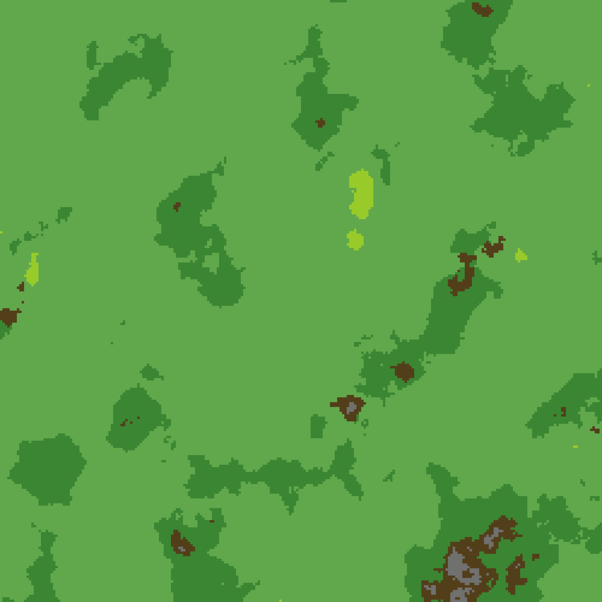

# Evolutionary Species Simulation

## Overview

This repository contains an implementation of a predator-prey ecosystem simulation using object-oriented programming. The simulation models interactions between species, environmental conditions, and maps that define their habitats.

### Goal

The main goal of this repository is to simulate the interaction between species, predators, and prey in a dynamically evolving environment. The species' behaviors, movements, and interactions are influenced by environmental factors, the layout of the terrain, and their evolutionary traits. This can serve as a foundation for studying ecological simulations, evolutionary biology, and other systems where entities interact and adapt to changes in their environment.

### Features

- **Predator-Prey Dynamics**: Models interactions between predators and prey, allowing the simulation of ecological relationships.
- **Map-based Environment**: Entities navigate a grid-based map where different terrain types influence their movement and survival.
- **Evolutionary Traits**: Simulates evolution, with species adapting based on their survival success.
- **Object-Oriented Design**: The code is modular and extensible, making it easy to expand and modify.

## Repository Structure

The structure of the repository is as follows:

```bash
│   general_test.ipynb
│   README.md
│
├───maps
│       map_1.json
│       map_2.json
│       settings_map_1.json
│       settings_map_2.json
│
├───models
│       animal.py
│       environment.py
│       evolutionary_species_simulation.py
│       mapcell.py
│       predator_prey.py
│       specie.py
│
└───species
        config_evolut_simulation.yaml
        config_species.yaml
```

- `predator_prey.py`: Implements the predator-prey interaction dynamics.
- `evolutionary_species_simulation.py`: Implements the general model with general number of species
- `environment.py`: Defines the environmental conditions and manage the interaction between species.
- `animal.py`: Implements the base class for different species.
- `specie.py`: Defines specific species and their behaviors.


## Map Visualization

The map is defined in the `map_1.json` file, which contains a grid of cells where each cell represents a different terrain type (e.g., forest, water, plains). This grid is used to simulate the environment where species interact. 

The map can be generated in [Gridmap-Playground](https://gridmap-playground.vercel.app/), where you can decide the map's biomes sizes ecc.

To visualize the map, a PNG file is generated, which provides a visual representation of the terrain types and species' distribution.



